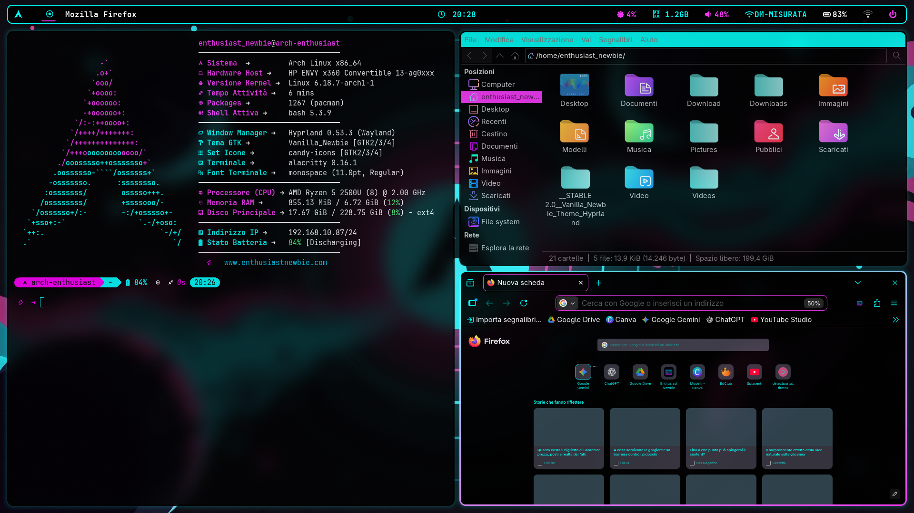
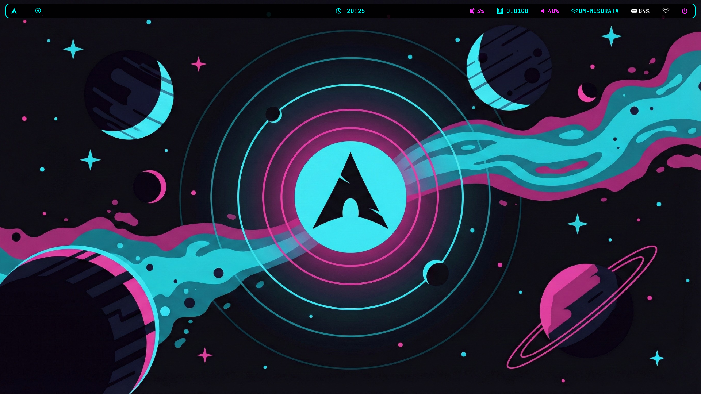

# Vanilla Newbie Theme - Hyprland Edition 



Benvenuti nel mio setup personale di **Arch Linux + Hyprland**. Questo repository raccoglie i miei dotfiles per creare un ambiente di lavoro coerente, minimale e personalizzato. 
Questo repository è pensato per chi vuole trasformare una installazione fresca di Arch Linux in un ambiente di lavoro moderno, coerente e completo di ogni comodità.



---

##  Componenti del Setup
- WM: Hyprland (Wayland)
- Terminale: Alacritty + Starship + Fastfetch
- Barra di sistema: Waybar
- Launcher: Wofi
- Tema GTK: Vanilla_Newbie (creato grazie a Themix per avere uno stile coerente tra app gtk2 gtk3 gtk4 e anche qt)
- Tema SDDM: Vanilla_Newbie_Theme_Sddm

## 📦 Dipendenze Necessarie 
Se hai appena installato Arch Linux e sei ancora davanti al terminale nero, copia e incolla questi comandi per avere tutto il necessario.

**Copia e incolla questo nel tuo terminale:**

```bash
sudo pacman -S hyprland hyprlock hyprpaper waybar wofi alacritty fastfetch starship sddm xdg-desktop-portal-hyprland xdg-desktop-portal-gtk polkit-kde-agent qt5ct qt6ct nwg-look pipewire wireplumber pipewire-audio pipewire-pulse pavucontrol network-manager-applet bluez bluez-utils blueman thunar thunar-volman tumbler gvfs gvfs-mtp thunar-archive-plugin file-roller wl-clipboard brightnessctl swappy grim slurp ttf-font-awesome otf-font-awesome ttf-jetbrains-mono-nerd gtk-murrine-engine xorg-xwayland mesa
```

## Dettaglio Pacchetti (Cosa stiamo installando?)

Ecco perché questi pacchetti sono fondamentali per la tua esperienza desktop:

* **Il Motore e l'Interfaccia (Core & Graphics):**
    * `hyprland`, `mesa` , `xorg-xwayland`, `sddm` : Il Window Manager ,i driver necessari e la schermata di login.
    * `waybar` & `wofi`: La tua barra di stato e il menu per lanciare le applicazioni.
    * `alacritty`, `fastfetch` & `starship`: Per un terminale bello da vedere .

* **Il "Cervello" del Sistema (Integrazione & Portali):**
    * `xdg-desktop-portal-hyprland` & `-gtk`: Permettono alle app di "parlare" con il sistema (es. per scegliere file o condividere lo schermo).
    * `polkit-kde-agent`: La finestra che ti chiede la password per le operazioni di sistema.
    * `nwg-look`, `qt5ct` & `qt6ct`: Per applicare il tema Vanilla_Newbie a ogni singola finestra, garantendo coerenza totale.

* **Suono e Connessioni (Audio & Connectivity):**
    * `pipewire` & `pavucontrol` , `network-manager-applet`, `bluez` & `blueman` : Gestione audio , wifi e bluetooth.

* **Gestione File Completa (Thunar) e Utility:**
    * `thunar`, `gvfs` ,`thunar-volman` , `file-roller` : Per avere un file manager completo
    * `wl-clipboard` & `cliphist`: Gestione avanzata del copia-incolla con cronologia.
    * `grim`, `slurp` & `swappy`: Per catturare lo schermo e modificare al volo gli screenshot.

---

## "Installazione" Automatica 
Per chi vuole tutto pronto in pochi secondi, ho creato uno script che sposta tutti i dotfiles nelle rispettive cartelle. 
> [!TIP]
> Ti consiglio comunque di dare un'occhiata all'installazione manuale per capire come sono organizzati i file, e per ESSERE SICURO DI NON PERDERE NESSUN PASSAGGIO

> [!WARNING]
> Lo script di installazione **NON effettua backup automatici**. Assicurati di fare una copia dei tuoi file originali prima di procedere.

1. Apri la cartella:
```bash
cd Vanilla_Newbie_Theme_Hyprland
```
2. Rendi eseguibile lo script: 
```bash
chmod +x install.sh
```
3. Esegui:
```bash
./install.sh
```

---

## Guida all'"Installazione" Manuale (se non vuoi usare lo script sopra)

### 1. Configurazioni Applicazioni (.config)
**Copia le cartelle** 'hypr', 'waybar', 'wofi' , 'dunst' , 'fastfetch' e 'alacritty' all'interno della tua cartella nascosta .config nella Home:
Comando: cp -r hypr waybar wofi fastfetch dunst alacritty ~/.config/

*Nota: Assicurati di dare i permessi di esecuzione a `~/.config/waybar/scripts/power-menu.sh`.*

**Wallpaper:** Copia la cartella 'Pictures' nella tua Home (~/Pictures).
**IMPORTANTE:** Apri ~/.config/hypr/hyprpaper.conf e correggi il percorso dell'immagine sostituendo il mio nome utente con il tuo.


### 2.1 Tema delle Finestre (GTK)
Copia la cartella 'Vanilla_Newbie' nel percorso dei temi del tuo utente:
Comando: cp -r Vanilla_Newbie ~/.themes/
(Nota: Se la cartella ~/.themes non esiste, creala prima!)


### 2.2. Coerenza App Qt (VLC, OBS, ecc.) 💡 TIP
Le app Qt  ignorano il tema GTK. Se vuoi forzarle a usare i nostri colori (altrimenti puoi saltare questo passaggio) :

1. Installa i pacchetti qt5ct e qt6ct.
2. Crea la cartella: `mkdir -p ~/.config/environment.d`
3. Crea il file `qt.conf` al suo interno.
4. Incolla questa riga: `QT_QPA_PLATFORMTHEME=qt5ct`
5. I file per i colori delle app Qt si trovano in Vanilla_Newbie/kde/.
   Copia i file .conf delle cartelle qt5ct e qt6ct nei rispettivi percorsi in ~/.config/qt5ct/colors/ e ~/.config/qt6ct/colors/.
6. Al riavvio, apri 'qt5ct' e 'qt6ct' per selezionare il tema .


### 3. Schermata di Login (SDDM)
Questa parte richiede permessi di amministratore:
1. Copia la cartella: 
```bash
sudo cp -r Vanilla_Newbie_Theme_Sddm /usr/share/sddm/themes/
```
2. Attiva il tema: 
Modifica il file /etc/sddm.conf cercando la sezione [Theme] e scrivendo:
```bash
Current=Vanilla_Newbie_Theme_Sddm
```

### 4. Personalizzazione Firefox
Nella cartella 'firefox' di questo repository troverai un file 'readme'. Aprilo per trovare il link diretto ai Mozilla Addons: lì ho caricato il tema con i colori ufficiali "Vanilla Newbie" per rendere il browser coerente con il resto del desktop.
https://addons.mozilla.org/it/firefox/addon/vanilla_newbie/

### 5. Personalizzazione Terminale (Fastfetch & Starship)

Per un’esperienza completa, ho incluso le configurazioni per rendere il terminale non solo utile, ma anche bello da vedere.

**Requisiti:** * Installa i pacchetti: `fastfetch` e `starship`.
* **Font:** È fondamentale avere un **Nerd Font** installato (es. *JetBrainsMono Nerd Font*) per visualizzare correttamente le icone di Starship.

#### 5.1 Fastfetch (Informazioni Sistema)
Fastfetch è l'alternativa moderna e veloce a Neofetch.

1. Crea la cartella: `mkdir -p ~/.config/fastfetch`
2. Copia la configurazione: `cp fastfetch/config.jsonc ~/.config/fastfetch/`
3. Per vederlo all'apertura del terminale, aggiungi la riga `fastfetch` in fondo al tuo file `~/.bashrc` (o `~/.zshrc`).

#### 5.2 Starship (Prompt Personalizzato)
Starship è un prompt minimale, personalizzabile e velocissimo.

1. Copia la configurazione: 
```bash
cp starship/starship.toml ~/.config/
```
2. **Attivazione:** Aggiungi la seguente riga alla fine del tuo file `~/.bashrc` (o `~/.zshrc` se usi Zsh):

```bash
eval "$(starship init bash)"
```

*(Sostituisci `bash` con `zsh` se usi quel tipo di shell).*

---


## Troubleshooting (Risoluzione Problemi)

Q: Waybar mostra dei quadratini al posto delle icone?
A: Non hai installato 'ttf-font-awesome'. Installalo e riavvia la barra.

Q: Lo schermo è nero o la risoluzione è sbagliata all'avvio?
A: In 'hypr/hyprland.conf', controlla la riga 'monitor='. Ogni PC ha un nome monitor diverso (es. eDP-1, DP-1). Usa il comando 'hyprctl monitors' per trovare il tuo e modificalo nel file.

Q: Il Power Menu (spegnimento/riavvio) non funziona?
A: Controlla di aver dato i permessi di esecuzione allo script 'power-menu.sh' e che il pacchetto 'wofi' sia installato correttamente.

Q: Internet o il Volume non appaiono su Waybar?
A: I nomi delle interfacce di rete cambiano (es. wlan0, enp3s0). Controlla il tuo con 'ip link' e aggiorna la sezione [network] nel file 'waybar/config'.

---

## 📝 Note del Progetto
- Questo è solo l'hobby di un appassionato. Se trovi degli errori ti prego di  perdonarmi e segnalarmelo ;) 
- Il tema GTK di questo setup è stato generato e personalizzato grazie al progetto **Themix/Oomox**: https://github.com/themix-project/themix-gui

---

##  Enthusiast_Newbie
Segui i miei esperimenti e fallimenti:
* **YouTube:** [@enthusiastnewbie](https://youtube.com/@enthusiastnewbie)
* **Sito Web:** [enthusiastnewbie.com](https://enthusiastnewbie.com)
* **Social:** Instagram, TikTok, Facebook, Mastodon

---

